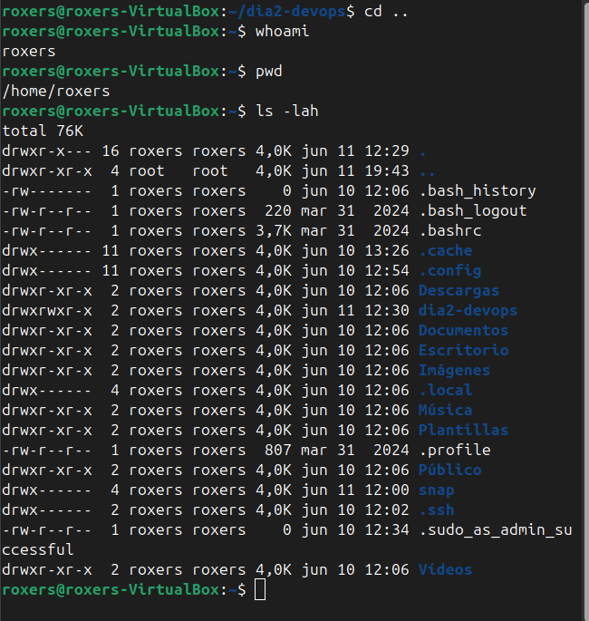
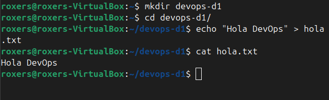
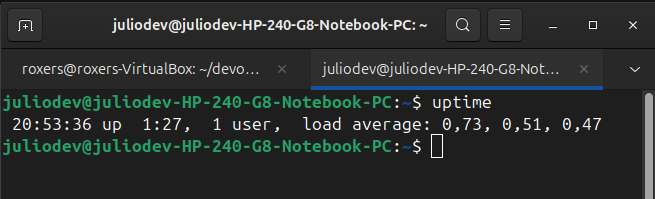
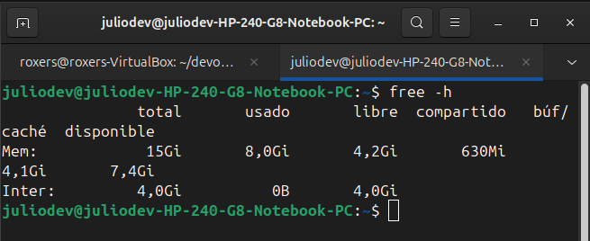

# 💬 Reflexión sobre DevOps

## 👉 ¿Qué significa DevOps para vos después de esta lección?

DevOps para mí es un enfoque que **integra el desarrollo de software y las operaciones** con el objetivo de **agilizar el ciclo de vida del software**.

Busca mejorar la **colaboración entre los equipos**, reducir errores, disminuir los tiempos y acelerar las implementaciones, promoviendo así una cultura de automatización, integración continua y entrega continua.

---

## 👉 ¿Qué herramientas ya conocías y cuáles son nuevas?

### 🔧 Herramientas que ya conocía:

- **Linux**
- **AWS**
- **Docker**
- **Ansible**
- **Jenkins**
- **Kubernetes**
- **Terraform**
- **Prometheus**
- **Grafana**

## 2. 🖥️ Primeros Pasos en Linux

En esta sección se muestran los primeros comandos ejecutados en un entorno Linux.

### 📸 Capturas de pantalla

#### 🔹 Commandos Basicos de Linux

## 3. 🎯 Desafío: ¡Linux Detectives!

### 👉 ¿Cuánto tiempo lleva encendido tu sistema?

### 👉 ¿Qué procesos están consumiendo más recursos?

### 👉 ¿Cuánta memoria disponible tenés?

