# Actividades Dia 2

## 🚀 Caso Práctico: Instalar y Configurar Nginx

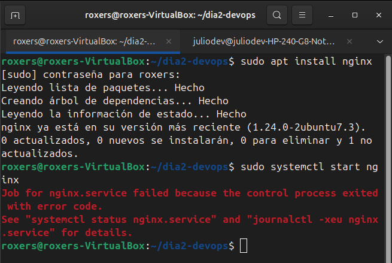

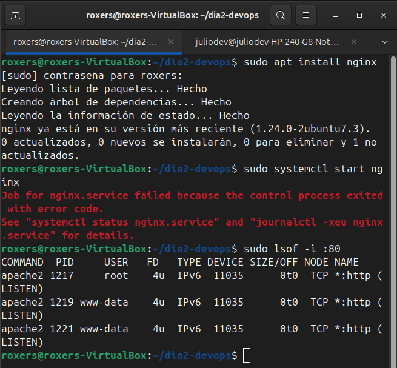

### Se produjo un error al iniciar Nginx porque otro servicio (Apache2) ya estaba utilizando el mismo puerto (por defecto, el 80). La solución fue detener el servicio de Apache2 y luego iniciar Nginx correctamente.

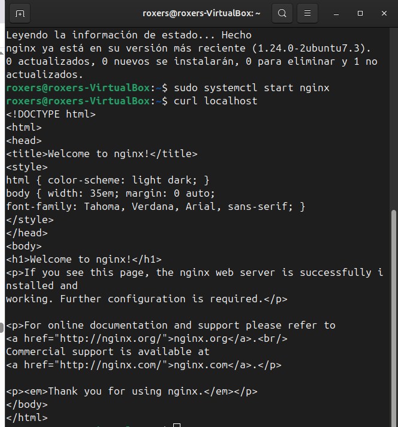

## 🌍 Desplegando un "Hola Mundo" en Apache.

### 🚀 Paso 2: Instalar Apache

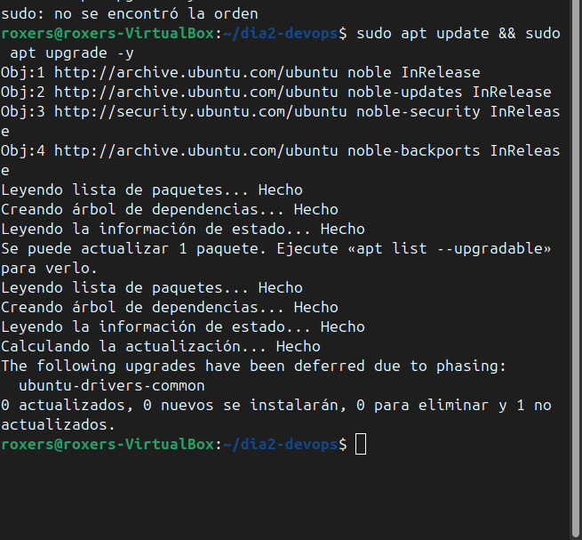

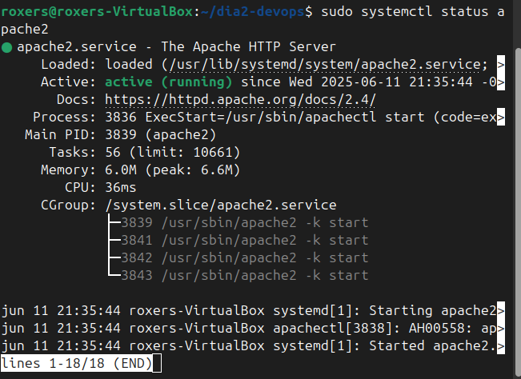

### 📂 Paso 3: Crear la Página Web

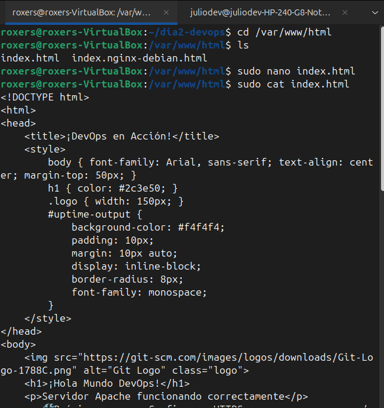

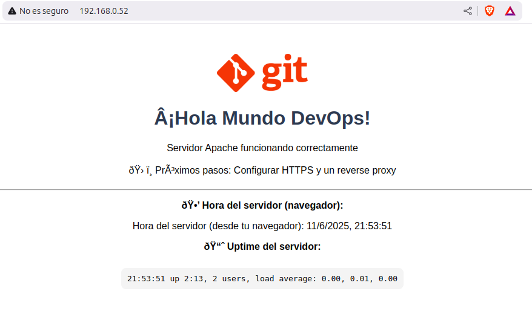

## 📚 Tarea Opcional del Día 2

#### 🛠️ 1. Exploración básica

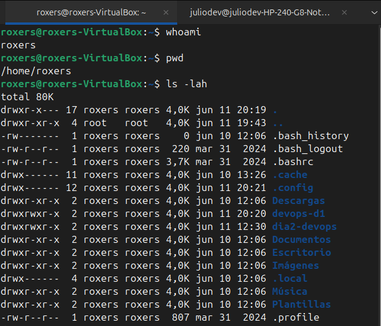

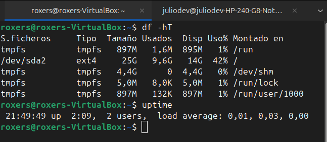

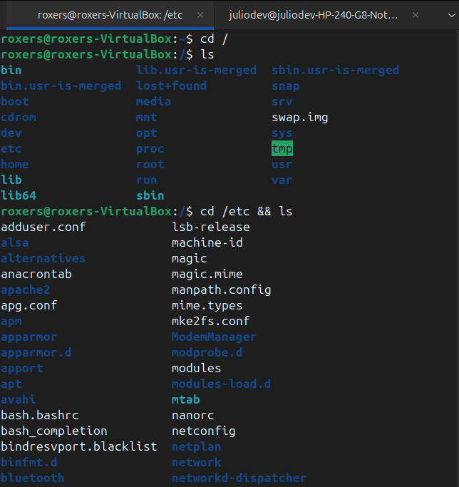

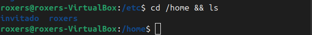

#### 📂 2. Crea y manipulá archivos

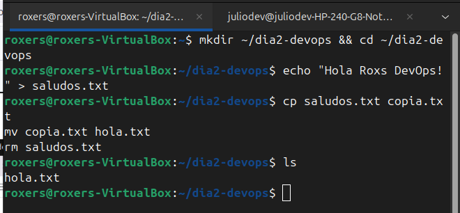

