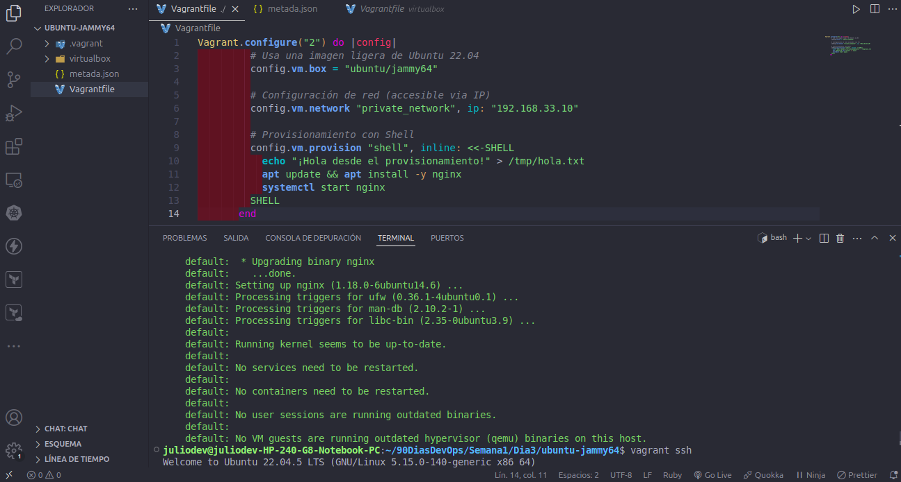
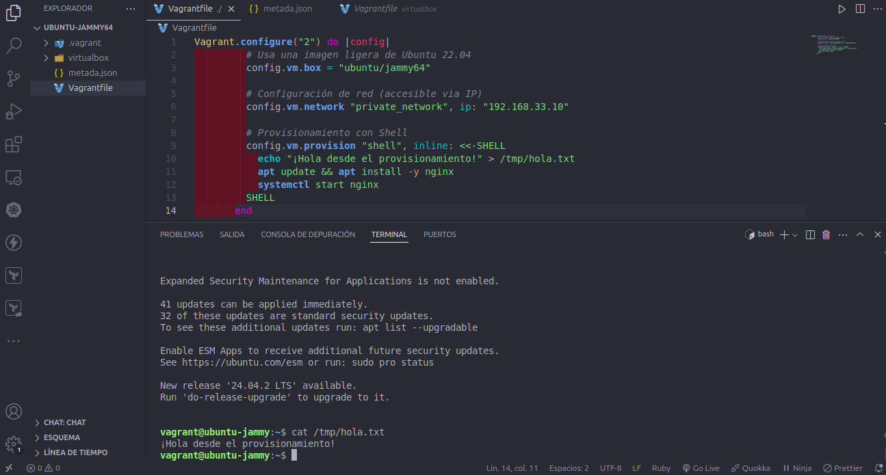
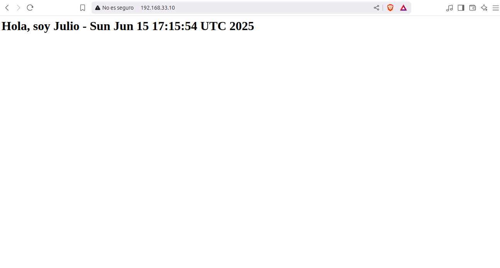
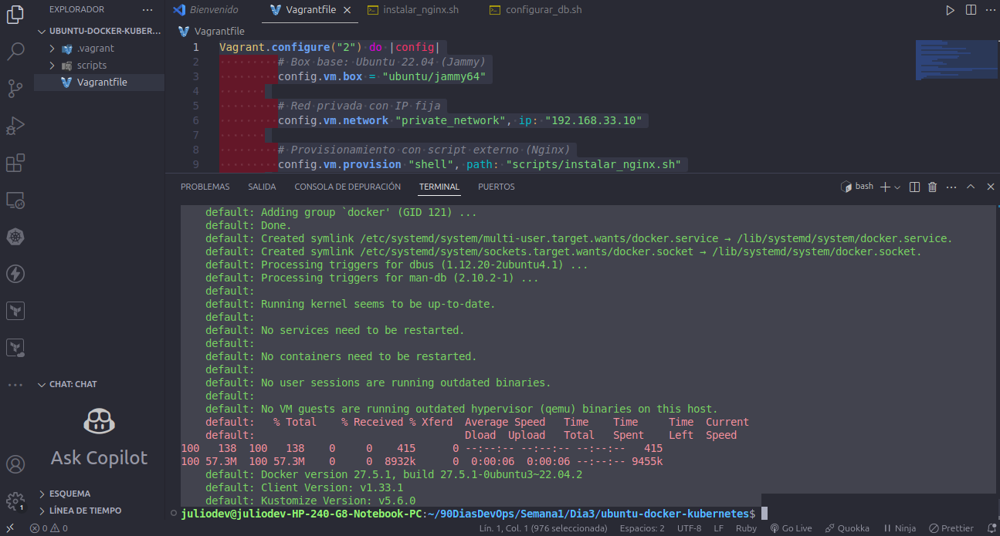
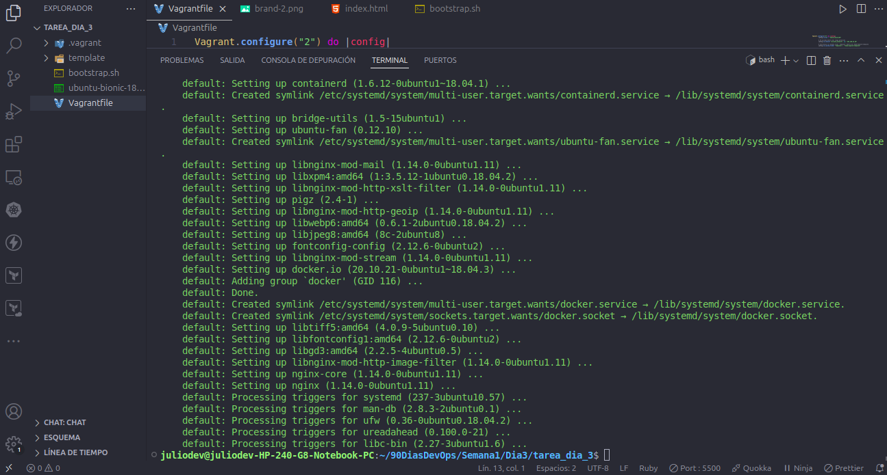
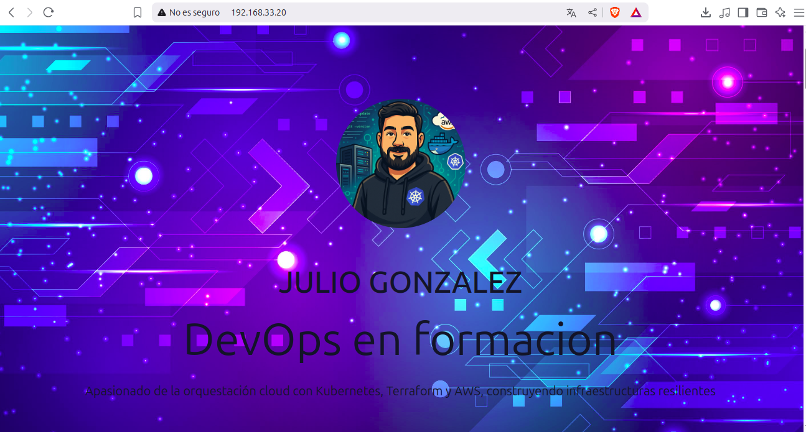

# 🚀 Vagrant: Automatización con Shell

### 🏗️ Tu Primer Vagrantfile

#### Aprendi a utilizar Vagrant herramienta que te ayuda a ponteciar la productividad.
#### Primer ejercicio de levantar una VM

#### Segundo ejercicio tener una VM con Docker y Kubernetes

#### Tarea del Dia3

