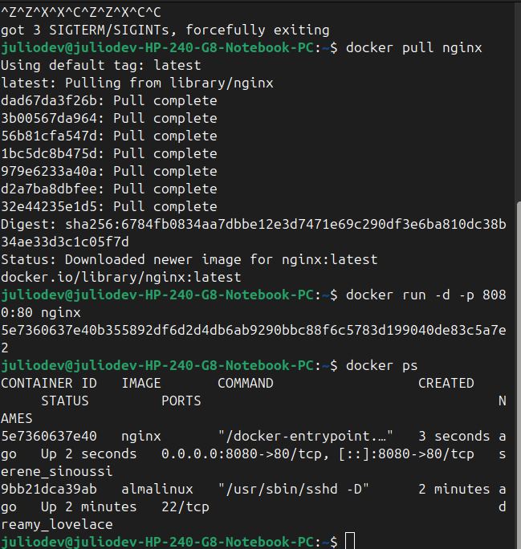

# 🚢 Aprende qué es Docker, cómo funciona y ejecuta tu primer contenedor

### Actividad Dia 1

#### Realizar ejemplos con Docker ps, images, pull y run. Limpe mi historial de docker con el commando "docker images --filter "dangling=true" -q | xargs -r docker rmi". Solo dejando los contenedores mas activos que tuve ultimamente.

