# 🐳 Construye, ejecuta y entiende tu primer contenedor

### 🚀 Configurá tu primer contenedor Docker

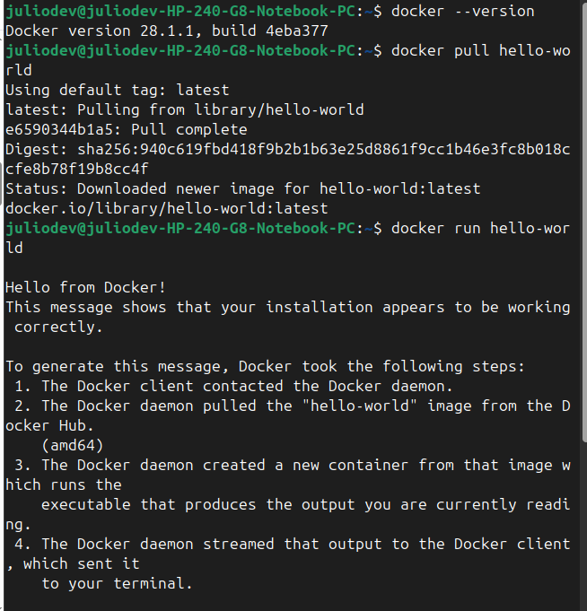

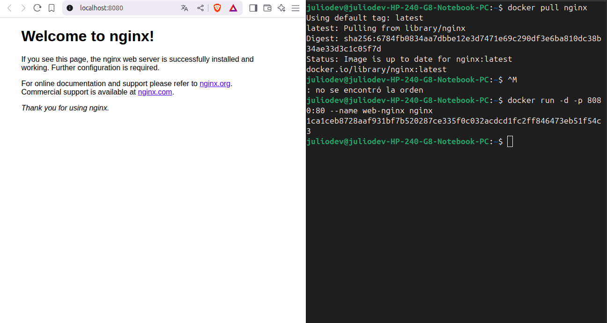

#### 🧰 Comandos esenciales para gestión de contenedores

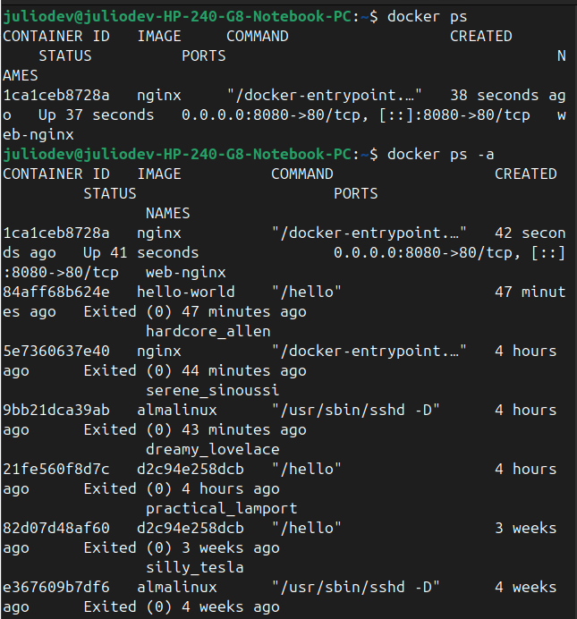

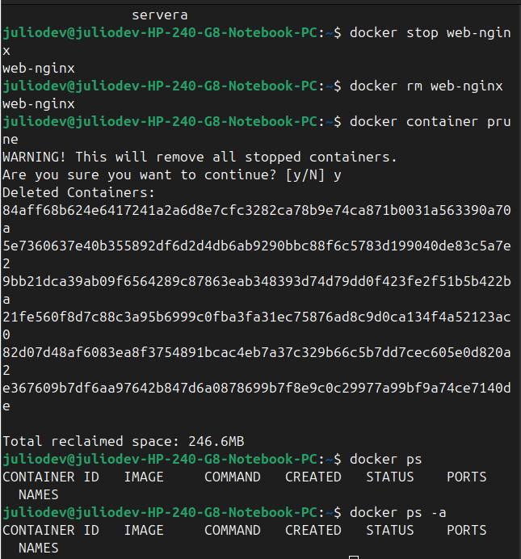

### 🧪 Contenedores interactivos

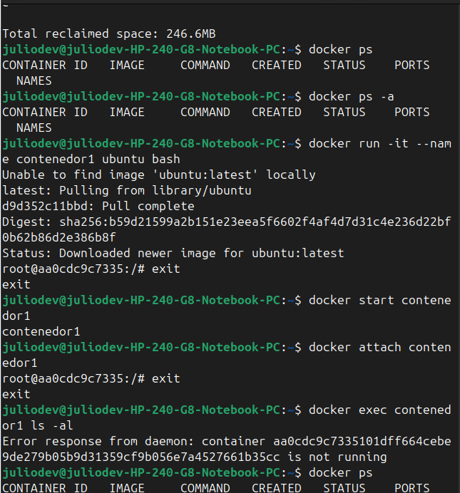

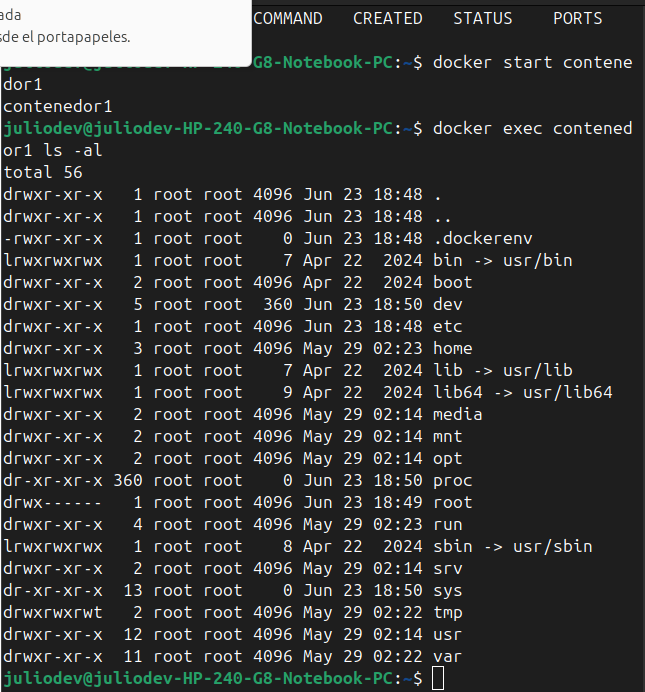

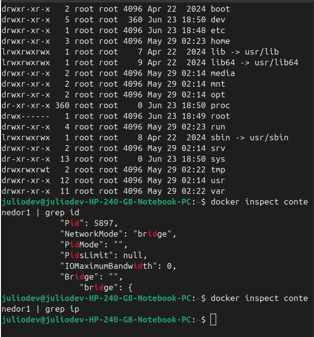

## ✅ Tarea del Día
### 🚀 Tarea del Día extra: ¡Tu Primer Sitio Web en un Contenedor!

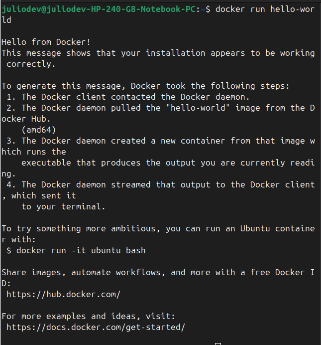

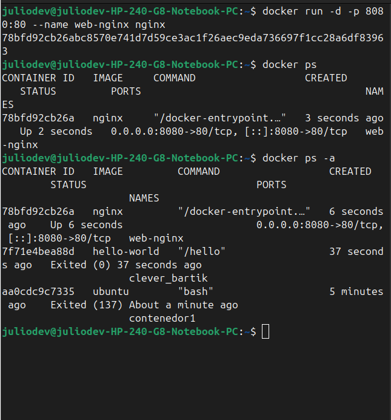

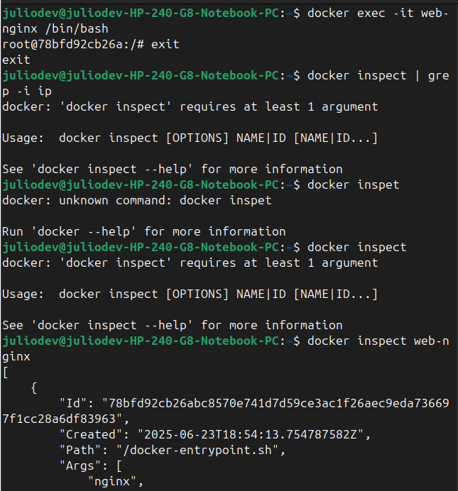

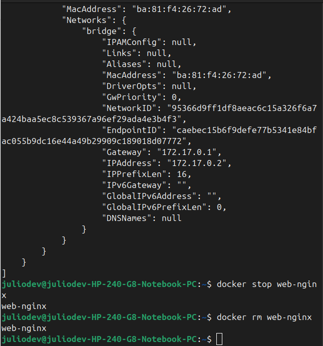

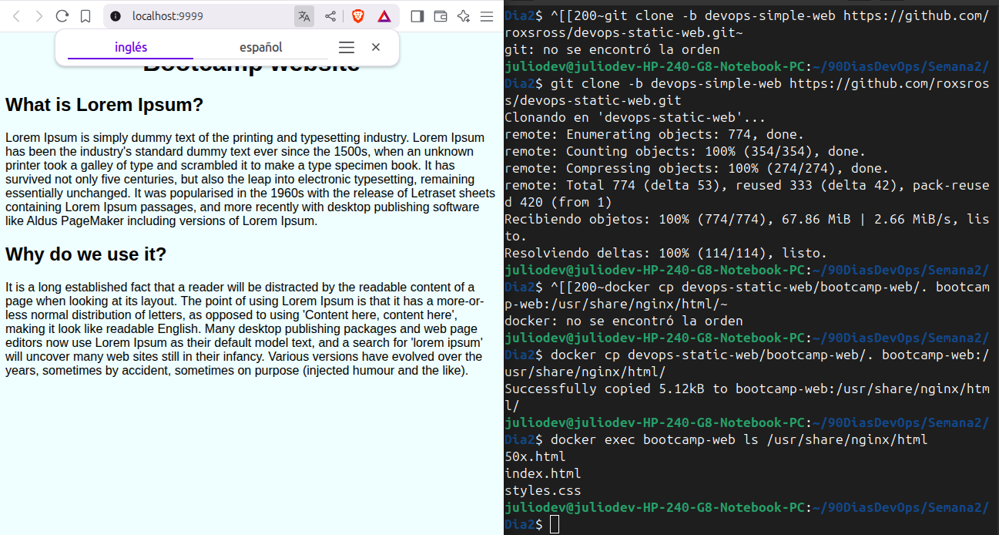

