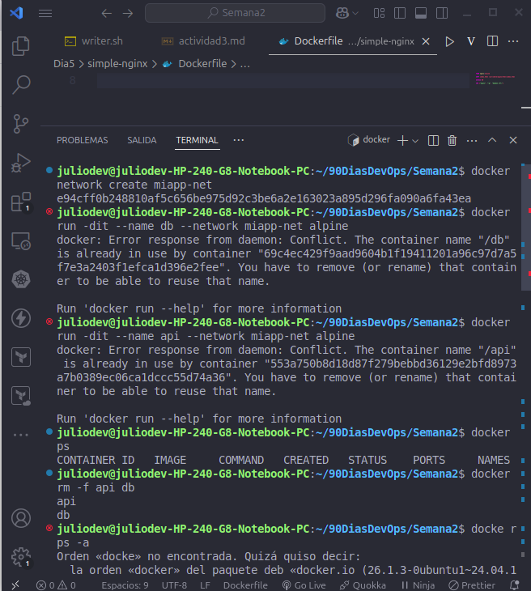
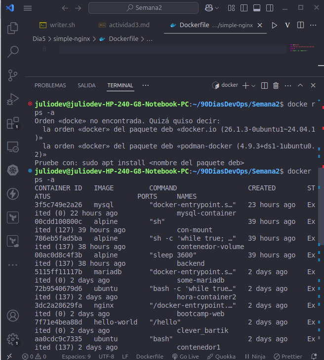
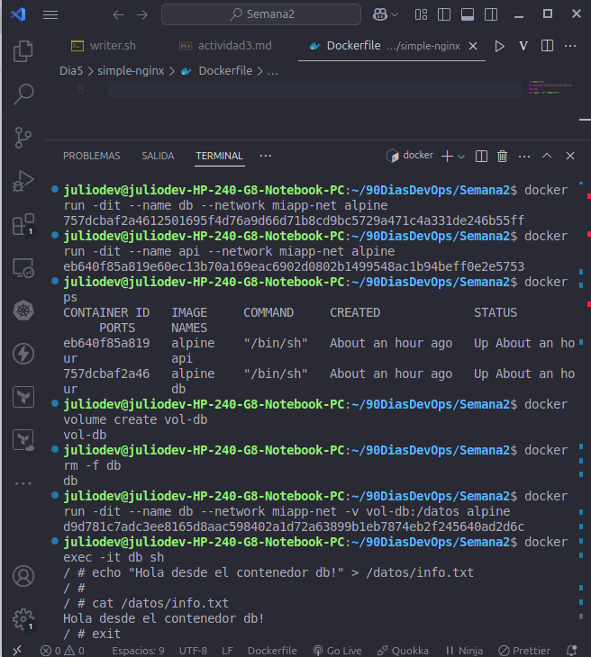
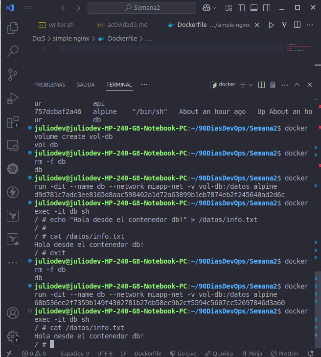
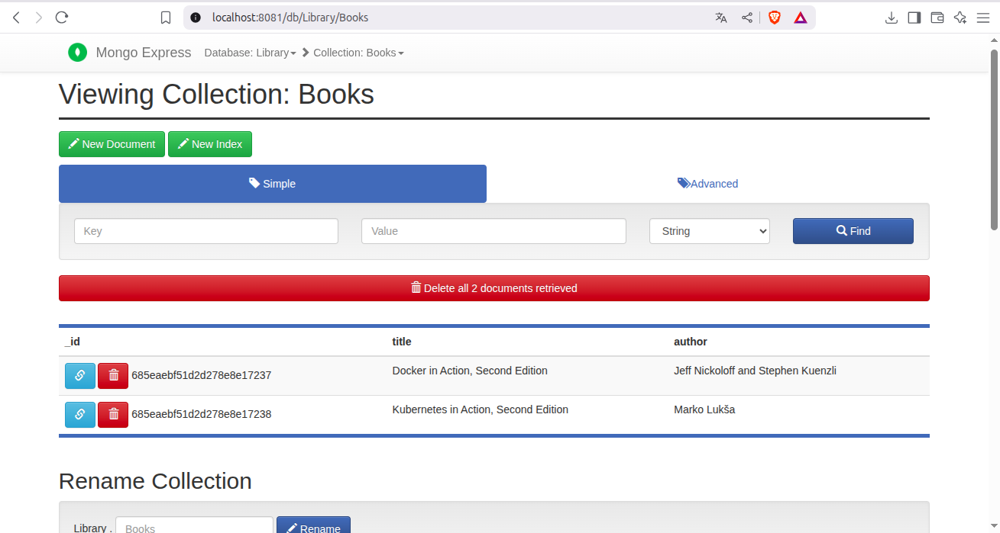

# 🚀 90 Días DevOps - Día 11

## 📚 Desafío: Redes, Volúmenes y Mongo Express con Docker

En este ejercicio práctico del día 11 del reto **#90DiasDevOps**, se trabajó con contenedores Docker conectados por una red personalizada, se probaron volúmenes persistentes y se desplegó una base de datos MongoDB con su interfaz visual **Mongo Express**.

---

## 🎯 Objetivos

- Crear una red Docker personalizada para interconectar contenedores.
- Probar la persistencia de volúmenes en contenedores.
- Levantar MongoDB y Mongo Express como contenedores conectados.
- Importar datos JSON a MongoDB utilizando `mongoimport`.

---

## 🐳 Paso a paso

### 🔹 1. Crear una red personalizada

```bash
docker network create miapp-net
```

---

### 🔹 2. Crear un volumen y probar persistencia

```bash
docker volume create vol-db
docker run -dit --name db --network miapp-net -v vol-db:/datos alpine
docker exec -it db sh
```

Dentro del contenedor:

```sh
echo "Hola desde el contenedor db!" > /datos/info.txt
exit
```

Eliminar y recrear contenedor:

```bash
docker rm -f db
docker run -dit --name db --network miapp-net -v vol-db:/datos alpine
docker exec -it db cat /datos/info.txt
```

✔️ Se verificó que el archivo se conservó gracias al volumen.

---

### 🔹 3. Desplegar MongoDB

```bash
docker run -d \
  --name mongo \
  --network miapp-net \
  -e MONGO_INITDB_ROOT_USERNAME=admin \
  -e MONGO_INITDB_ROOT_PASSWORD=secret \
  mongo
```

---

### 🔹 4. Desplegar Mongo Express

```bash
docker run -d \
  --name mongo-express \
  --network miapp-net \
  -e ME_CONFIG_MONGODB_ADMINUSERNAME=admin \
  -e ME_CONFIG_MONGODB_ADMINPASSWORD=secret \
  -e ME_CONFIG_MONGODB_SERVER=mongo \
  -p 8081:8081 \
  mongo-express
```

Luego se accede a:  
👉 [http://localhost:8081](http://localhost:8081)  
Usuario: `admin`  
Contraseña: `pass`

---

### 🔹 5. Importar datos JSON a MongoDB

Se creó el archivo `books.json` con este contenido:

```json
[{ "title": "Docker in Action, Second Edition", "author": "Jeff Nickoloff and Stephen Kuenzli" },{ "title": "Kubernetes in Action, Second Edition", "author": "Marko Lukša" }]
```

Se importó con:

Se cambio a la configuracion del array.


✔️ Luego se visualizó correctamente en Mongo Express.

---

## ✅ Resultado Final

El sistema quedó funcionando con:

- Contenedores conectados por red Docker personalizada.
- Volumen persistente comprobado.
- MongoDB y Mongo Express desplegados y conectados.
- Colección `Books` con documentos importados visibles desde navegador.

---

## 🖼 Capturas de pantalla











## 🧠 Aprendizajes

Este ejercicio refuerza conocimientos clave sobre:

- Redes Docker (`docker network`)
- Volúmenes persistentes
- Variables de entorno en contenedores
- Conexión entre servicios (DB + UI)
- Importación de datos a MongoDB

---

## ✍️ Autor

**Julio Alejandro González**  
💻 DevOps en formación - #90DiasDevOps
