# 🏗️ Aprende a trabajar a construir imágenes Docker

## Lo aprendido

- Cómo usar Dockerfile para personalizar imágenes.
- Uso de docker network para permitir comunicación entre contenedores.
- Configuración de Nginx como reverse proxy hacia otro contenedor.

## Captura de ejemplo

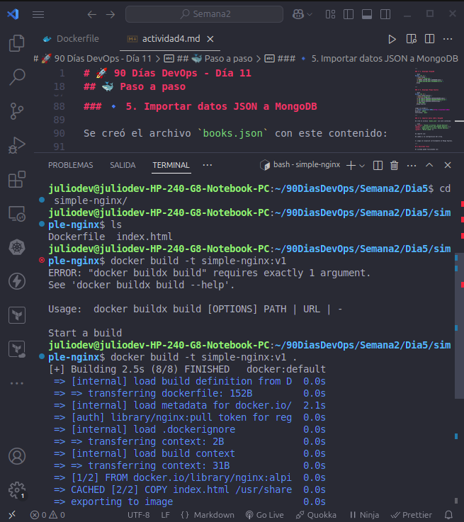
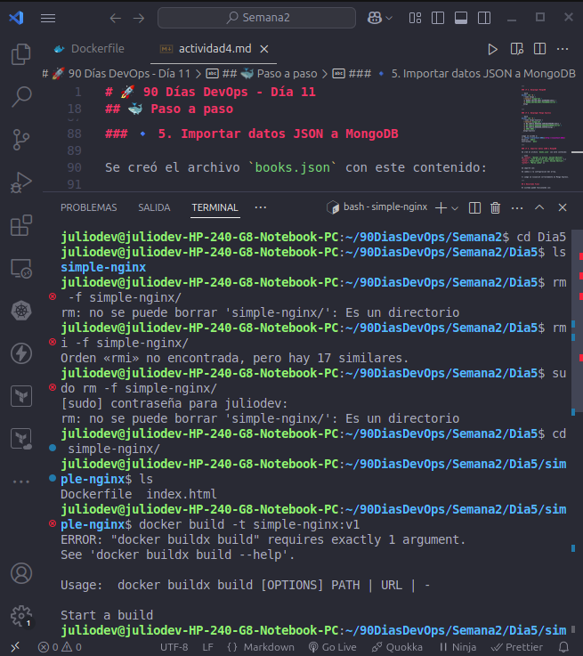
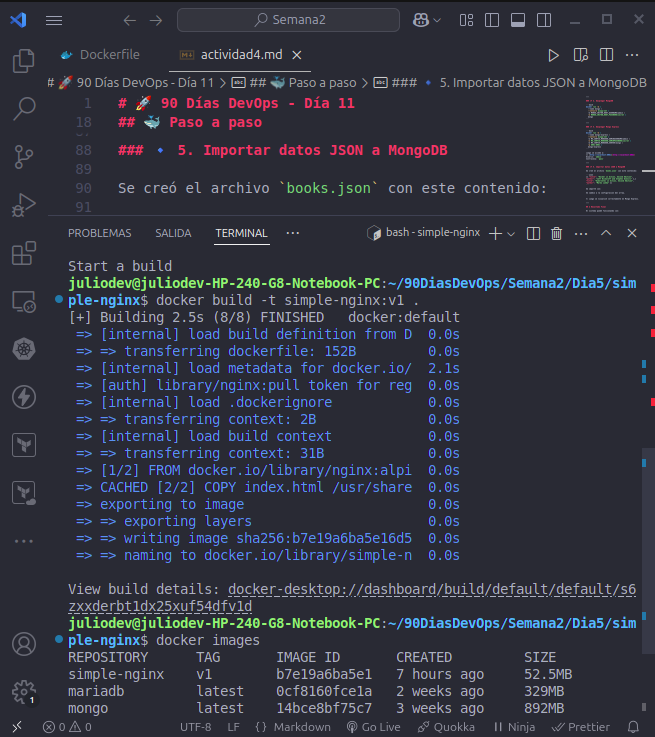

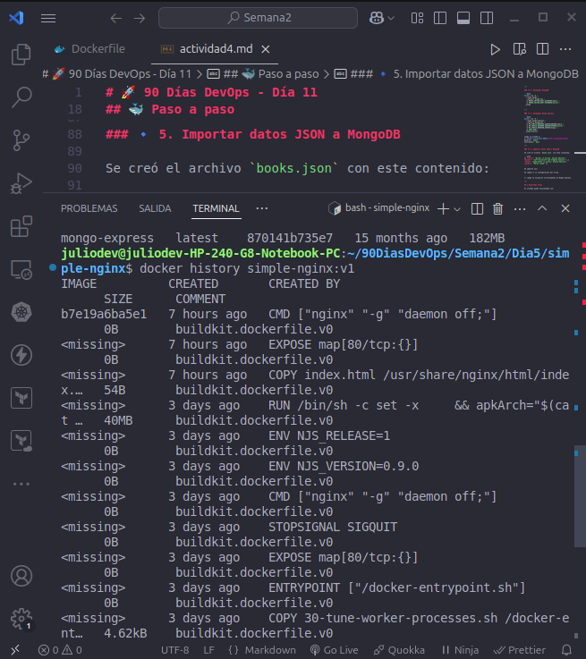
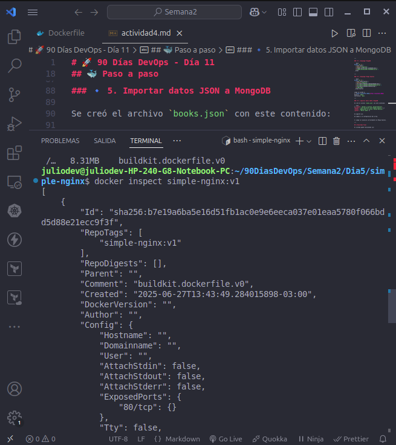
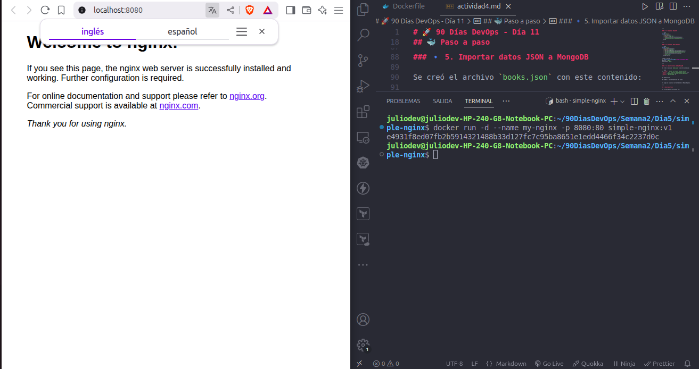
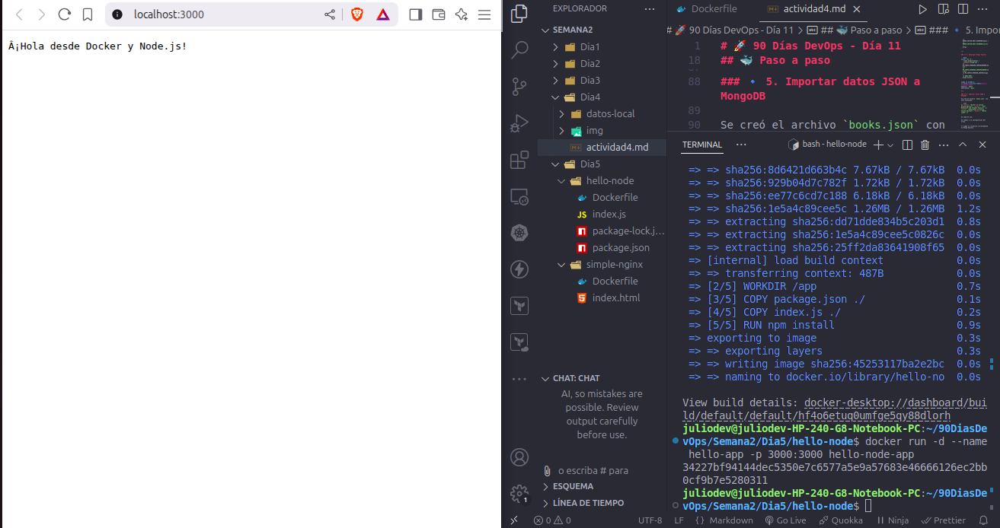

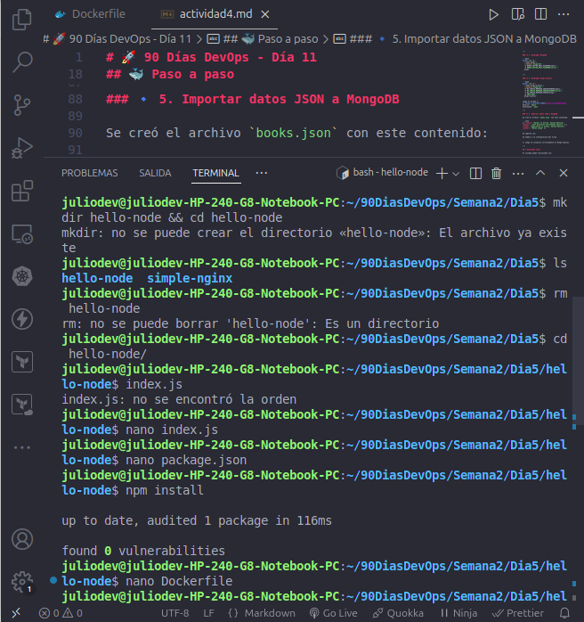
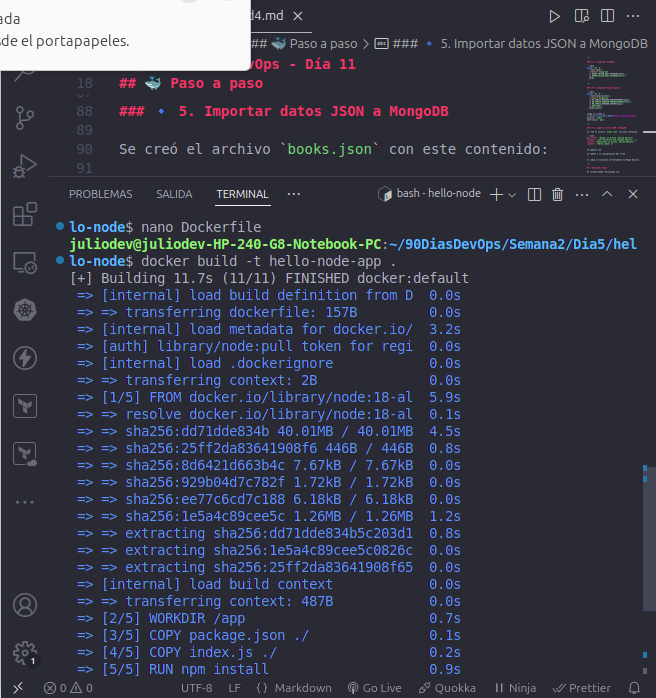
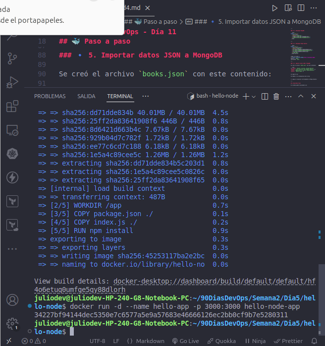
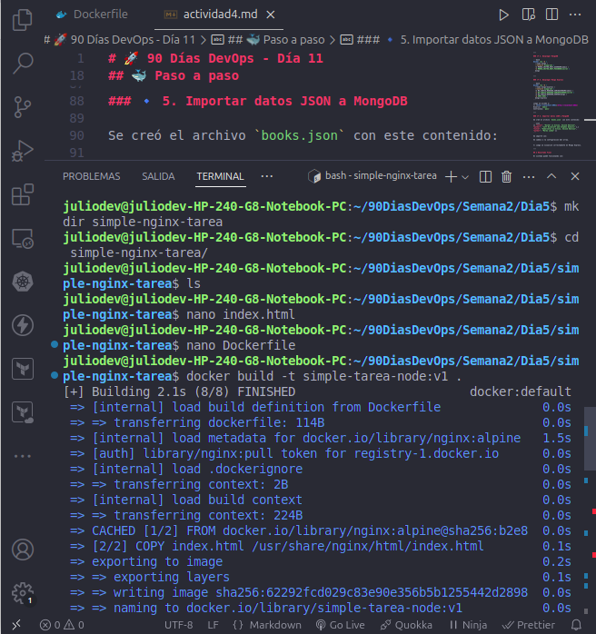
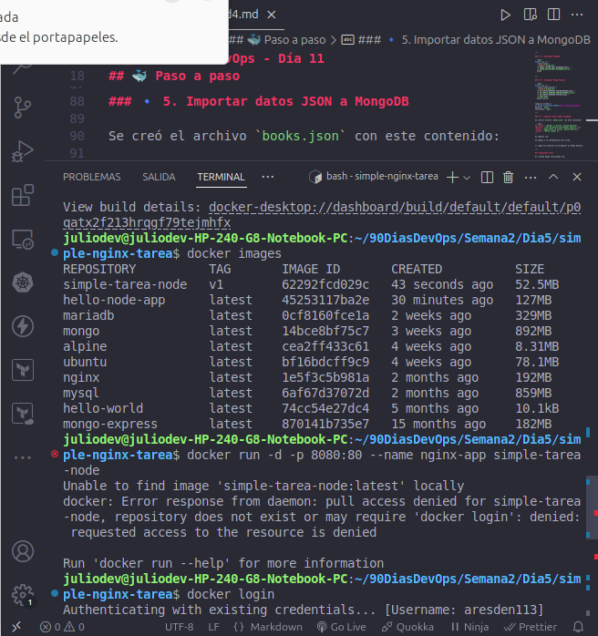
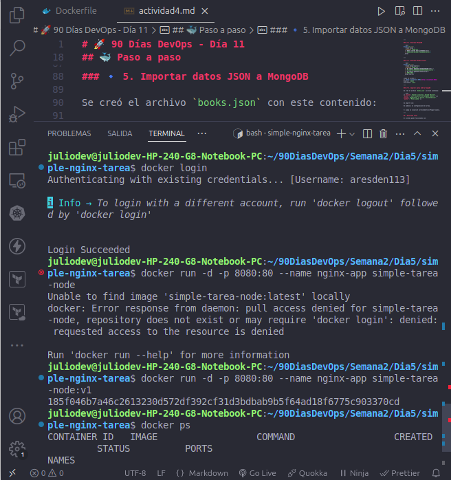
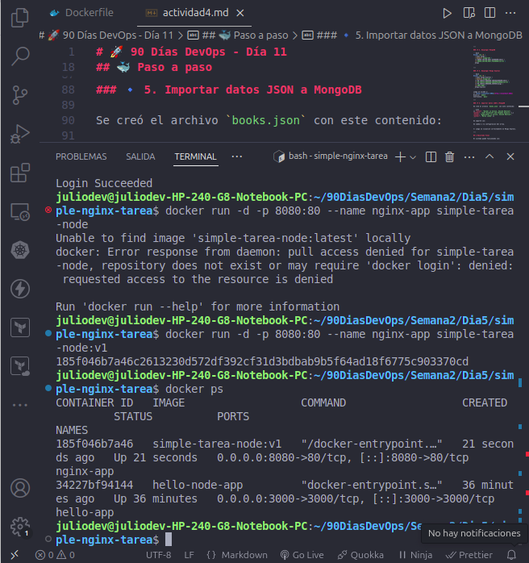
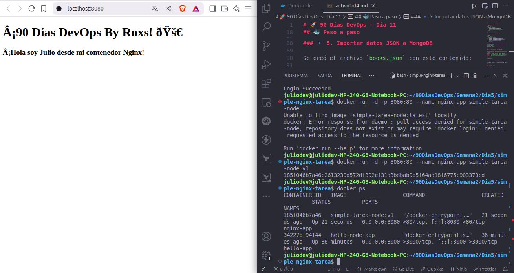
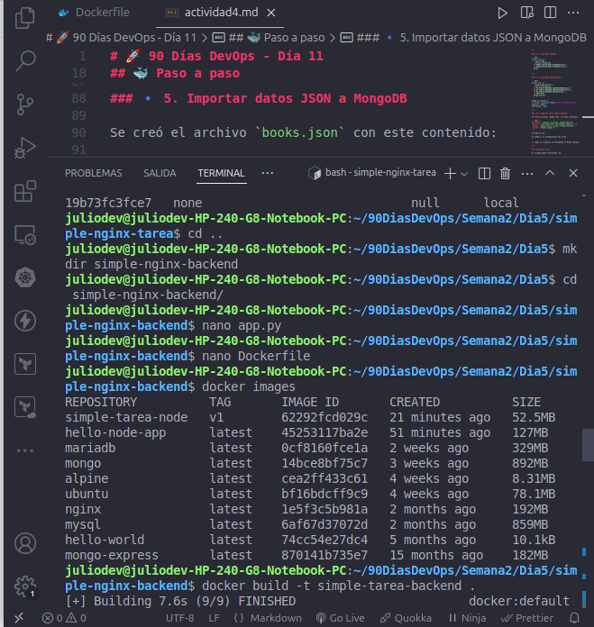
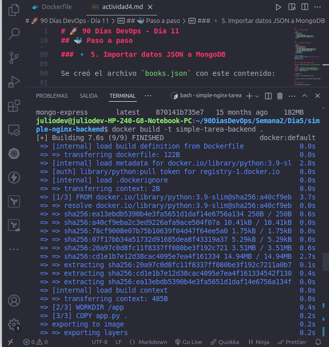
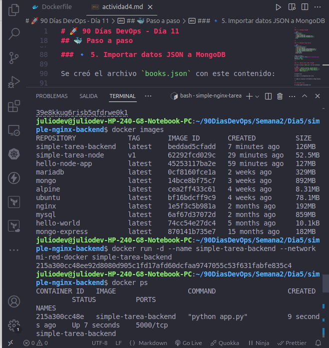
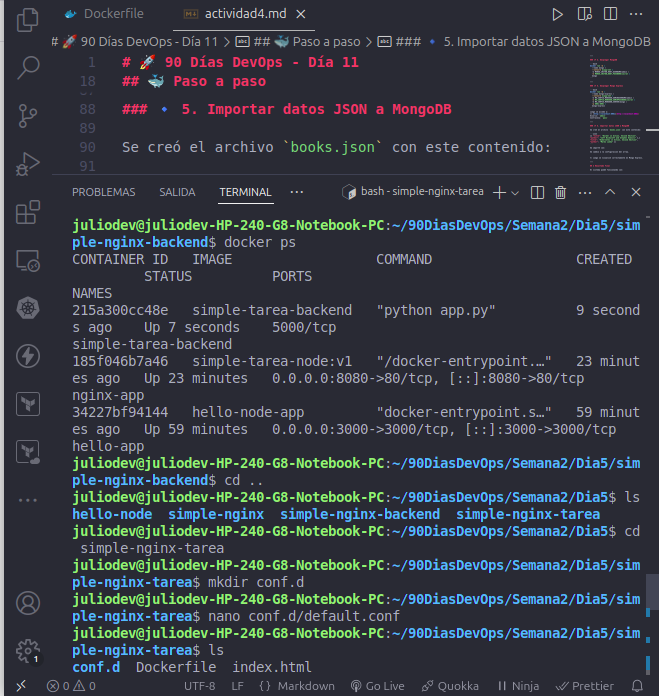
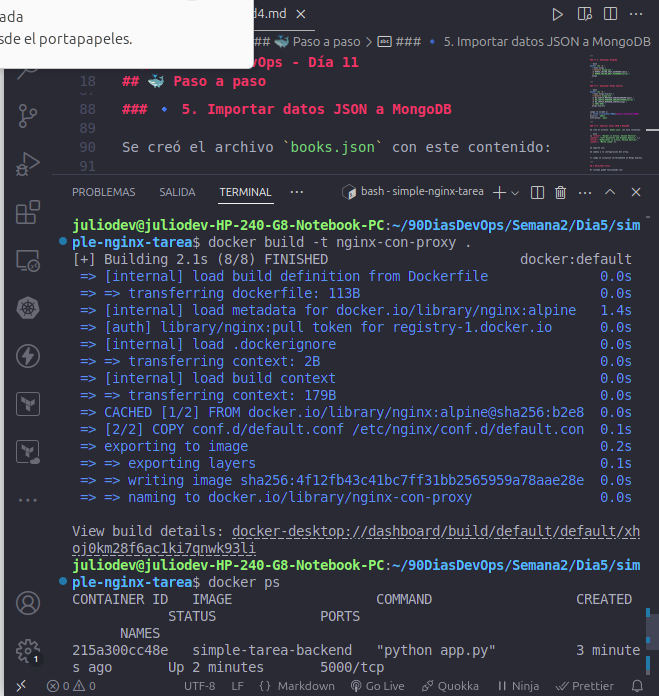
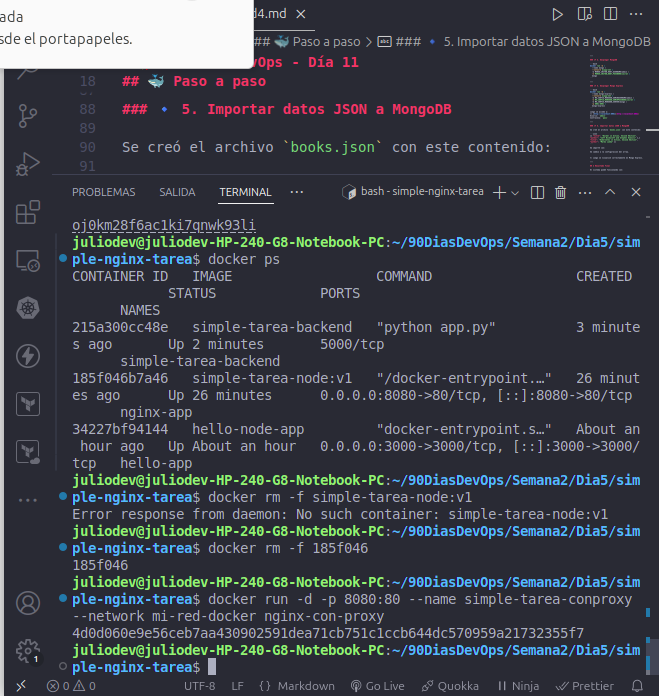
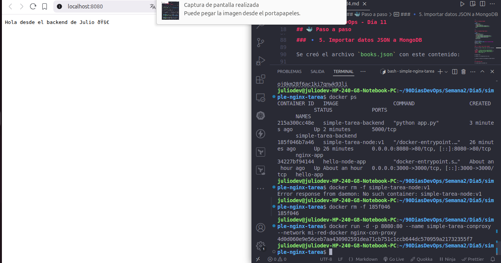

