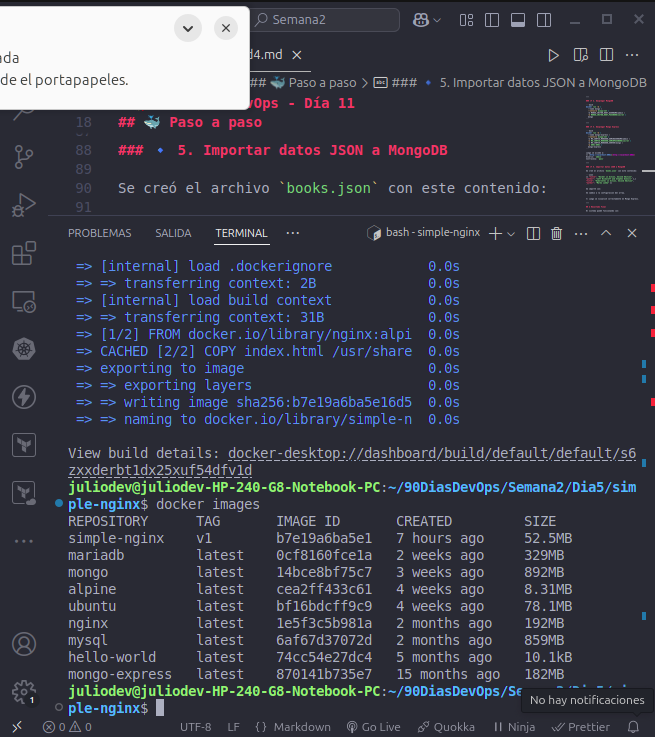

# Desafío Docker Multi-Contenedor con Nginx y Backend Python

Este proyecto es parte de un desafío DevOps en el que se construye una aplicación simple utilizando múltiples contenedores Docker. Se aprende a:

- Crear imágenes personalizadas
- Usar redes Docker personalizadas
- Conectar contenedores entre sí

## Estructura del Proyecto

.
├── simple-nginx/
│   ├── Dockerfile
│   └── conf.d/
│       └── default.conf
└── simple-backend/
    ├── Dockerfile
    └── app.py

## Paso a paso

### 1. Crear una red personalizada

```bash
docker network create mi-red-docker
```

### 2. Backend Python

#### Build de la imagen

```bash
cd simple-backend
docker build -t backend-julio .
```

#### Correr el contenedor

```bash
docker run -d --name backend-julio --network mi-red-docker backend-julio
```

Este contenedor levanta un servidor HTTP en el puerto 5000 que responde con:

Hola desde el backend de Julio 🚀

### 3. Nginx como Reverse Proxy

#### simple-nginx/conf.d/default.conf

```nginx
server {
    listen 80;

    location / {
        proxy_pass http://backend-julio:5000;
    }
}
```

#### Dockerfile

```dockerfile
FROM nginx:alpine
COPY conf.d/default.conf /etc/nginx/conf.d/default.conf
```

#### Build de la imagen

```bash
cd simple-nginx
docker build -t nginx-con-proxy .
```

#### Correr el contenedor

```bash
docker run -d -p 8080:80 --name nginx-julio --network mi-red-docker nginx-con-proxy
```

## Verificar

Abrir el navegador en: http://localhost:8080

Deberías ver:

Hola desde el backend de Julio 🚀

## Lo aprendido

- Cómo usar Dockerfile para personalizar imágenes.
- Uso de docker network para permitir comunicación entre contenedores.
- Configuración de Nginx como reverse proxy hacia otro contenedor.

## Captura de ejemplo





## Bonus: Variables de entorno en Dockerfile

También se puede crear una imagen con variables de entorno así:

```Dockerfile
FROM alpine
ENV SALUDO="¡Hola Roxs DevOps!"
CMD ["sh", "-c", "echo $SALUDO && sleep 5"]
```

```bash
docker build -t saludo-roxs .
docker run --rm saludo-roxs
```

## Autor

Julio Alejandro González

Proyecto realizado como parte del reto de 90 días DevOps
