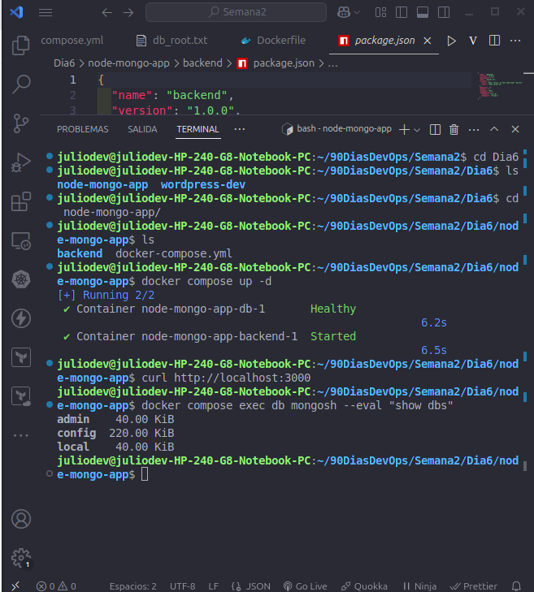
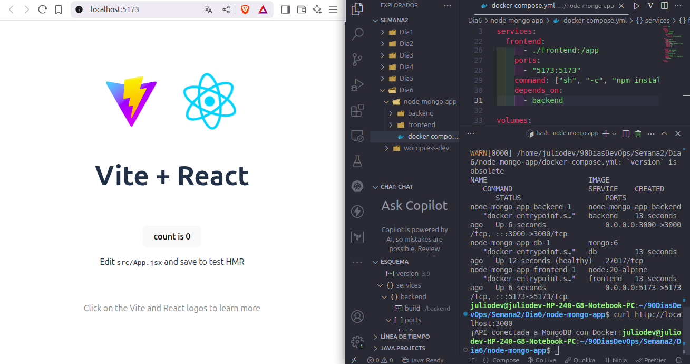

# Actividad 6 - node-mongo-app

Este proyecto es una aplicación de ejemplo llamada **node-mongo-app** que consiste en un stack completo con frontend, backend y base de datos MongoDB, orquestado con Docker Compose.

---

## 🧱 Estructura de la App

- **Frontend**: Aplicación React creada con Vite.
- **Backend**: Servidor Node.js utilizando Express y Mongoose.
- **Base de datos**: MongoDB (imagen oficial `mongo:6`).

---

## 🚀 Tecnologías utilizadas

- Docker
- Docker Compose
- Node.js (v18 en backend, v20 en frontend)
- MongoDB
- React + Vite
- Mongoose

---

## 📁 Estructura del proyecto

```
node-mongo-app/
├── backend/         # Código del servidor Node.js + Express
│   ├── Dockerfile
│   └── ...
├── frontend/        # Proyecto Vite + React
│   ├── package.json
│   └── ...
├── docker-compose.yml
└── actividad6.md    # Este archivo
```

---

## 🐳 Cómo levantar el entorno con Docker

1. **Clonar el repositorio (si aplica):**

```bash
git clone <repo-url>
cd node-mongo-app
```

2. **Levantar los contenedores:**

```bash
docker compose up -d --build
```

3. **Verificar los servicios:**

```bash
docker compose ps
```

4. **Acceder a las aplicaciones:**

- Frontend: [http://localhost:5173](http://localhost:5173)
- Backend (API): [http://localhost:3000](http://localhost:3000)

---

## 🔍 Notas importantes

- Se usó `--host` al iniciar Vite para exponerlo a la red (`0.0.0.0`).
- El backend espera que Mongo esté listo, usando `healthcheck` en `docker-compose.yml`.
- Las carpetas `frontend/` y `backend/` están montadas como volúmenes para desarrollo activo.
- El frontend puede comunicarse con el backend usando la URL `http://backend:3000`.

---

## 📦 Comandos útiles

Ver logs de un servicio:

```bash
docker compose logs frontend
docker compose logs backend
```

Parar y eliminar todo:

```bash
docker compose down -v
```

---

## ✨ Resultado

Este ejercicio refuerza el uso de **Docker Compose** para levantar entornos de desarrollo completos, conectando múltiples servicios (frontend, backend y base de datos) con facilidad.


### Imagenes del proyecto


