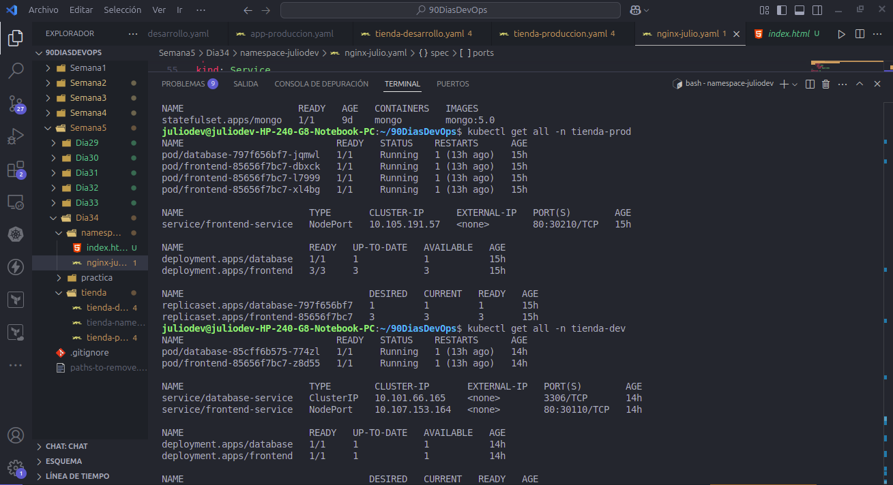
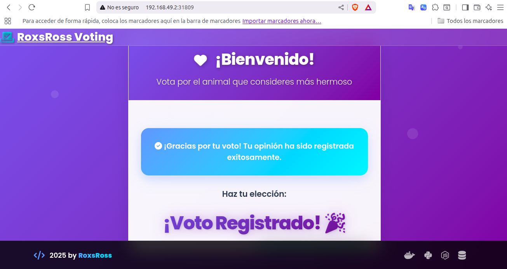
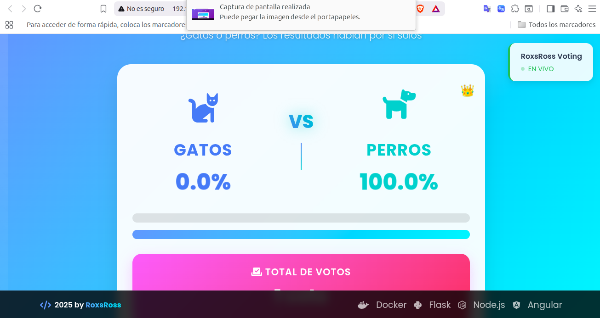
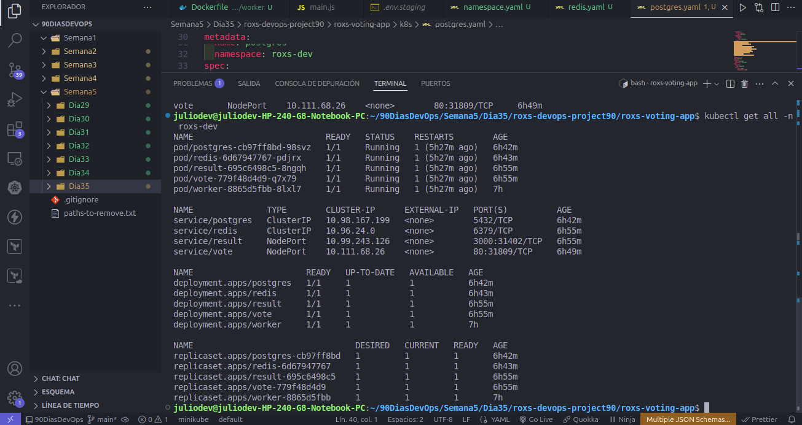

# 🚀 Actividad Día 35 - 90 Días DevOps

En este día desplegamos la aplicación **roxs-voting-app** en Kubernetes
utilizando **Deployments**, **Services** y un **Namespace** dedicado
(`roxs-dev`).

## 📌 Recursos Desplegados

-   **Namespace**
    -   `roxs-dev`
-   **Deployments**
    -   `vote` → Aplicación frontend (Node.js)
    -   `result` → Aplicación de resultados (Python/Flask)
    -   `worker` → Procesa los votos en segundo plano
    -   `redis` → Base de datos en memoria para registrar votos
    -   `postgres` → Base de datos para almacenar resultados
-   **Services**
    -   `vote` → NodePort (expuesto en el puerto **31809**)
    -   `result` → NodePort (expuesto en el puerto **31402**)
    -   `redis` → ClusterIP
    -   `postgres` → ClusterIP

## 🔑 Comandos Principales

``` bash
# Ver pods en el namespace
kubectl get pods -n roxs-dev

# Ver servicios en el namespace
kubectl get svc -n roxs-dev

# Acceder al servicio de voto (frontend)
minikube service vote -n roxs-dev --url

# Acceder al servicio de resultados
minikube service result -n roxs-dev --url
```

## ✅ Resultado Final

Al ejecutar los servicios desde **Minikube**, pudimos acceder a:

-   **Frontend (Vote App)** → Permite votar entre dos opciones.\
-   **Backend (Result App)** → Muestra en tiempo real los resultados.

Con esto finalizamos el **Día 35**, consolidando el despliegue de una
aplicación multi-servicio en Kubernetes. 🎉

## Imagenes








